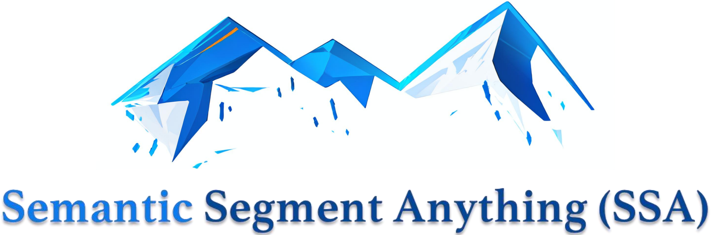
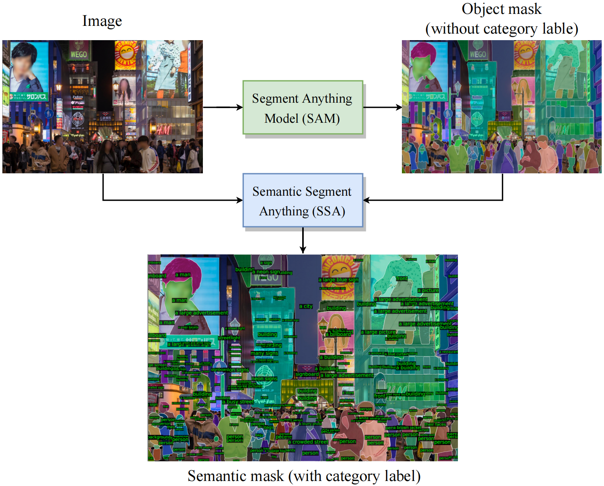
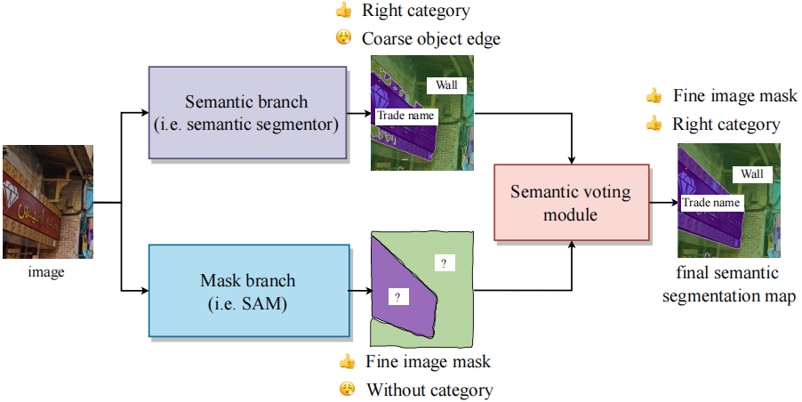
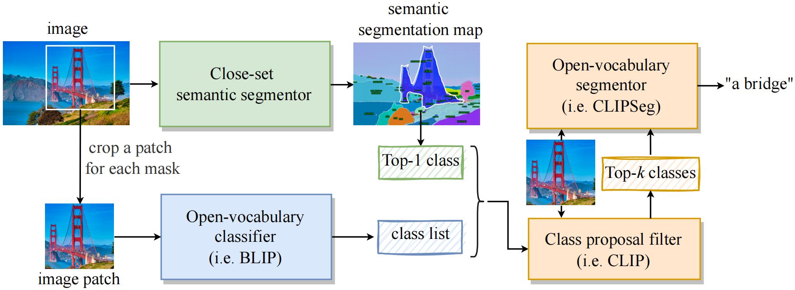
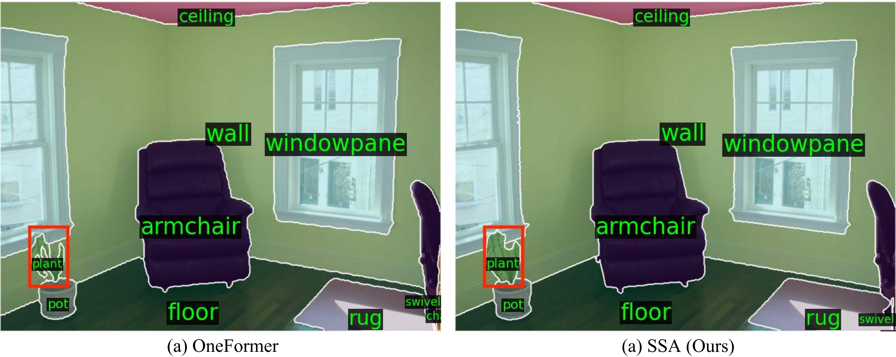

<p align="center">
  
</p>

### [Official repo](https://github.com/fudan-zvg/Semantic-Segment-Anything), [Web Demo](https://replicate.com/cjwbw/semantic-segment-anything)
> **[Semantic Segment Anything](https://github.com/fudan-zvg/Semantic-Segment-Anything)**  
> Jiaqi Chen, Zeyu Yang, and Li Zhang  
> Zhang Vision Group, Fudan Univerisity

SAM is a powerful model for arbitrary object segmentation, while SA-1B is the largest segmentation dataset to date. However, SAM lacks the ability to predict semantic categories for each mask. 
(I) To address above limitation, we propose a pipeline on top of SAM to predict semantic category for each mask, called **_Semantic Segment Anything (SSA)_**.
(II) Moreover, our SSA can serve as an automated dense open-vocabulary annotation engine called **_Semantic segment anything labeling engine (SSA-engine)_**, providing rich semantic category annotations for SA-1B or any other dataset. This engine significantly reduces the need for manual annotation and associated costs.

### Web demo and API
- Try the Web Demo and API here: [](https://replicate.com/cjwbw/semantic-segment-anything) 

### 🤔 Why do we need SSA project?
- SAM is a highly generalizable object segmentation algorithm that can provide precise masks. SA-1B is the largest image segmentation dataset to date, providing fine mask segmentation annotations. Neither SAM nor SA-1B provide category predictions or annotations for each mask. This makes it difficult for researchers to use the powerful SAM algorithm to directly solve semantic segmentation tasks or to utilize SA-1B to train their own models.
- Advanced close-set segmenters like Segformer, Oneformer, open-set segmenters like CLIPSeg, and image caption methods like BLIP can provide rich semantic annotations. However, their mask segmentation predictions may not be as comprehensive and accurate as those generated by SAM, which has highly precise and detailed boundaries.
- Therefore, by combining the fine image segmentation masks from SAM and SA-1B with the rich semantic annotations provided by these advanced models, we can generate semantic segmentation models with stronger generalization ability, as well as a large-scale densely categorized image segmentation dataset.
### 👍 What SSA project can do?
- **SSA:** This is the first open framework that utilizes SAM for semantic segmentation task. It supports users to seamlessly integrate their existing semantic segmenters with SAM without the need for retraining or fine-tuning SAM's weights, enabling them to achieve better generalization and more precise mask boundaries.  
- **SSA-engine:** SSA-engine provides dense open-vocabulary category annotations for large-scale SA-1B dataset. After manual review and refinement, these annotations can be used to train segmentation models or fine-grained CLIP models.
### ✈️ SSA: Semantic segment anything

Before the introduction of SAM, most semantic segmentation application scenarios already had their own models. These models could provide rough category classifications for regions, but were blurry and imprecise at the edges, lacking accurate masks. To address this issue, we propose an open framework called SSA that leverages SAM to enhance the performance of existing models. Specifically, the original semantic segmentation models provide category predictions while the powerful SAM provides masks.

If you have already trained a semantic segmentation model on your dataset, you don't need to retrain a new SAM-based model for more accurate segmentation. Instead, you can continue to use the existing model as the Semantic branch. SAM's strong generalization and image segmentation abilities can improve the performance of the original model. It is worth noting that SSA is suitable for scenarios where the predicted mask boundaries by the original segmentor are not highly accurate. If the original model's segmentation is already very accurate, SSA may not provide a significant improvement.

SSA consists of two branches, Mask branch and Semantic branch, as well as a voting module that determines the category for each mask.
- **(I) Mask branch (blue).** SAM serves as the Mask branch and provides a set of masks with clear boundaries. 

- **(II) Semantic branch (purple).** This branch provides the category for each pixel, which is implemented by a semantic segmentor that users can customize in terms of the segmentor's architecture and the interested categories. The segmentor does not need to have highly detailed boundaries, but it should classify each region as accurately as possible.

- **(III) Semantic Voting module (red).** This module crops out the corresponding pixel categories based on the mask's position. The top-1 category among these pixel categories is considered as the classification result for that mask.
### 🚄 SSA-engine: Semantic segment anything labeling engine

SSA-engine is an automated annotation engine that serves as the initial semantic labeling for the SA-1B dataset. While human review and refinement may be required for more accurate labeling.
Thanks to the combined architecture of close-set segmentation and open-vocabulary segmentation, SSA-engine produces satisfactory labeling for most samples and has the capability to provide more detailed annotations using image caption method.

This tool fills the gap in SA-1B's limited fine-grained semantic labeling, while also significantly reducing the need for manual annotation and associated costs. 
It has the potential to serve as a foundation for training large-scale visual perception models and more fine-grained CLIP models.

The SSA-engine consists of three components:
- **(I) Close-set semantic segmentor (green).** Two close-set semantic segmentation models trained on COCO and ADE20K datasets respectively are used to segment the image and obtain rough category information. The predicted categories only include simple and basic categories to ensure that each mask receives a relevant label.
- **(II) Open-vocabulary classifier (blue).** An image captioning model is utilized to describe the cropped image patch corresponding to each mask. Nouns or phrases are then extracted as candidate open-vocabulary categories. This process provides more diverse category labels.
- **(III) Final decision module (orange).** The SSA-engine uses a Class proposal filter (_i.e._ a CLIP) to filter out the top-_k_ most reasonable predictions from the mixed class list. Finally, the Open-vocabulary Segmentor predicts the most suitable category within the mask region based on the top-_k_ classes and image patch.

### 📖 News
🔥 2023/04/14: SSA benchmarks semantic segmentation on ADE20K and Cityscapes.  
🔥 2023/04/10: Semantic Segment Anything (SSA and SSA-engine) is released.  
🔥 2023/04/05: SAM and SA-1B are released.  

## Results
All results were tested on a single NVIDIA A6000 GPU.

### 1. Inference time
| Dataset | model                        | Inference time per image (s) | Inference time per mask (s) |
|:--------|:-----------------------------|:-----------------------------|:----------------------------|
| SA-1B   | SSA (Close set)              | 1.149                        | 0.012                       |
| SA-1B   | SSA-engine (Open-vocabulary) | 33.333                       | 0.334                       |

### 2. Memory usage
#### SSA (with SAM)
| Dataset    | model      | GPU Memory (MB)        |
|:-----------|:-----------|:-----------------------|
| ADE20K     | SSA        | 8798                   |
| Cityscapes | SSA        | 19012                  |
#### SSA-engine
| Dataset    | model            | GPU Memory without SAM (MB) | GPU Memory with SAM (MB) |
|:-----------|:-----------------|:----------------------------|:-------------------------|
| SA-1B      | SSA-engine-small | 11914                       | 28024                    |
| SA-1B      | SSA-engine-base  | 14466                       | 30576                    |

### 3. Close-set semantic segmentation on ADE20K and Cityscapes dataset
For the sake of convenience, we utilized different versions of Segformer from [Hugging Face](https://huggingface.co/nvidia), 
which come with varying parameter sizes and accuracy levels (including B0, B2, and B5), 
to **simulate** semantic branches with less accurate masks.
The results show that when the accuracy of original Semantic branch is **NOT very high**, SSA can lead to an improvement in mIoU.

#### ADE20K
| Model | Semantic branch                                                                     | mIoU of Semantic branch | mIoU of SSA    |
|:------|:------------------------------------------------------------------------------------|:------------------------|:----------------------|
| SSA   | [Segformer-B0](https://huggingface.co/nvidia/segformer-b0-finetuned-ade-512-512)    | 31.78                   | 33.60                 |
| SSA   | [Segformer-B2](https://huggingface.co/nvidia/segformer-b2-finetuned-ade-512-512)    | 41.38                   | 42.92                 |
| SSA   | [Segformer-B5](https://huggingface.co/nvidia/segformer-b5-finetuned-ade-640-640)    | 45.92                   | 47.14                 |

#### Cityscapes
| Model | Semantic branch                                                                           | mIoU of Semantic branch | mIoU of SSA |
|:------|:------------------------------------------------------------------------------------------|:------------------------|:-------------------|
| SSA   | [Segformer-B0](https://huggingface.co/nvidia/segformer-b0-finetuned-cityscapes-1024-1024) | 52.52                   | 55.14              |
| SSA   | [Segformer-B2](https://huggingface.co/nvidia/segformer-b2-finetuned-cityscapes-1024-1024)                                                                          | 59.76                   | 62.25              |
| SSA   | [Segformer-B5](https://huggingface.co/nvidia/segformer-b5-finetuned-cityscapes-1024-1024) | 71.67                   | 72.99              |

Note that all Segformer checkpoint and data pipeline are sourced from [Hugging Face](https://huggingface.co/nvidia) released by NVIDIA, which shows lower mIoU compared to those on [official repository](https://github.com/NVlabs/SegFormer).
### 4. Cross-domain segmentation on Foggy Driving
We also evaluate the performance of SSA on the Foggy Driving dataset, with OneFormer as Semantic branch. 
The weight and data pipeline of OneFormer is sourced from [Hugging Face](https://huggingface.co/shi-labs/oneformer_cityscapes_swin_large).

| Model   | Training dataset | validation dataset | mIoU |
|:-------|:-----------------|:-------------------|:------|
| SSA   | Cityscapes       | Foggy Driving      | 55.61 |


## Examples
### Open-vocabulary prediction on SA-1B


- Addition example for Open-vocabulary annotations


### Close-set semantic segmentation on Cityscapes


### Close-set semantic segmentation on ADE20K


### Cross-domain segmentation on Foggy Driving


## 💻 Requirements
- Python 3.7+
- CUDA 11.1+

## 🛠️ Installation
```bash
git clone git@github.com:fudan-zvg/Semantic-Segment-Anything.git
cd Semantic-Segment-Anything
conda env create -f environment.yaml
conda activate ssa
python -m spacy download en_core_web_sm
# install segment-anything
cd ..
git clone git@github.com:facebookresearch/segment-anything.git
cd segment-anything; pip install -e .; cd ../Semantic-Segment-Anything
```
## 🚀 Quick Start
### 1. SSA
#### 1.1 Preparation
Dowload the ADE20K or Cityscapes dataset, and unzip them to the `data` folder.

**Folder sturcture:**
```none
├── Semantic-Segment-Anything
├── data
│   ├── ade
│   │   ├── ADEChallengeData2016
│   │   │   ├── images
│   │   │   │   ├── training
│   │   │   │   ├── validation
│   │   │   │   │   ├── ADE_val_00002000.jpg
│   │   │   │   │   ├── ...
│   │   │   │   ├── test
│   │   │   ├── annotations
│   │   │   │   ├── training
│   │   │   │   ├── validation
│   │   │   │   │   ├── ADE_val_00002000.png
│   │   │   │   │   ├── ...
│   ├── cityscapes
│   │   ├── leftImg8bit
│   │   │   ├── train
│   │   │   ├── val
│   │   │   │   ├── frankfurt
│   │   │   │   ├── lindau
│   │   │   │   ├── munster
│   │   │   │   │   ├── munster_000173_000019_leftImg8bit.png
│   │   ├── gtFine
│   │   │   ├── train
│   │   │   ├── val
│   │   │   │   ├── frankfurt
│   │   │   │   ├── lindau
│   │   │   │   ├── munster
│   │   │   │   │   ├── munster_000173_000019_gtFine_labelTrainIds.png
│   │   ├── ...
```

Dowload the checkpoint of SAM and put it to the `ckp` folder.
```bash
mkdir ckp && cd ckp
wget https://dl.fbaipublicfiles.com/segment_anything/sam_vit_h_4b8939.pth
cd ..
```
#### 1.2 SSA inference
Run our SSA on ADE20K with 8 GPUs:
```bash
python scripts/main_ssa.py --ckpt_path ./ckp/sam_vit_h_4b8939.pth --save_img --world_size 8 --dataset ade20k --data_dir data/ade20k/ADEChallengeData2016/images/validation/ --gt_path data/ade20k/ADEChallengeData2016/annotations/validation/ --out_dir output_ade20k
```

Run our SSA on Cityscapes with 8 GPUs:
```bash
python scripts/main_ssa.py --ckpt_path ./ckp/sam_vit_h_4b8939.pth --save_img --world_size 8 --dataset cityscapes --data_dir data/cityscapes/leftImg8bit/val/ --gt_path data/cityscapes/gtFine/val/ --out_dir output_cityscapes
```

Run our SSA on Foggy Driving with 8 GPUs:
```bash
python scripts/main_ssa.py --data_dir data/Foggy_Driving/leftImg8bit/test/ --ckpt_path ckp/sam_vit_h_4b8939.pth --out_dir output_foggy_driving --save_img --world_size 8 --dataset foggy_driving --eval --gt_path data/Foggy_Driving/gtFine/test/ --model oneformer
```
#### 1.3 SSA evaluation (after inference)
Get the evaluate result of ADE20K:
```bash
python scripts/evaluation.py --gt_path data/ade20k/ADEChallengeData2016/annotations/validation --result_path output_ade20k/ --dataset ade20k
```

Get the evaluate result of Cityscapes:
```bash
python scripts/evaluation.py --gt_path data/cityscapes/gtFine/val/ --result_path output_cityscapes/ --dataset cityscapes
```

Get the evaluate result of Foggy Driving:

```bash
# if you haven't downloaded the Foggy Driving dataset, you can run the following command to download it.
wget -P data https://data.vision.ee.ethz.ch/csakarid/shared/SFSU_synthetic/Downloads/Foggy_Driving.zip & unizp data/Foggy_Driving.zip -d data/

python scripts/evaluation.py --gt_path data/Foggy_Driving/gtFine/test/ --result_path output_foggy_driving/ --dataset foggy_driving
```
### 2. SSA-engine
#### Automatic annotation for your own dataset
Organize your dataset as follows:
```none
├── Semantic-Segment-Anything
├── data
│   ├── <The name of your dataset>
│   │   ├── img_name_1.jpg
│   │   ├── img_name_2.jpg
│   │   ├── ...
```
Run our SSA-engine-base with 8 GPUs (The GPU memory needed is dependent on the size of the input images):
```bash
python scripts/main_ssa_engine.py --data_dir=data/<The name of your dataset> --out_dir=output --world_size=8 --save_img --sam --ckpt_path=ckp/sam_vit_h_4b8939.pth
```

If you want to run the SSA-engine-small, you can use the following command  (add the `--light_mode` flag):
```bash
python scripts/main_ssa_engine.py --data_dir=data/<The name of your dataset> --out_dir=output --world_size=8 --save_img --sam --ckpt_path=ckp/sam_vit_h_4b8939.pth --light_mode
```
#### Automatic annotation for SA-1B
Download the [SA-1B](https://segment-anything.com/) dataset and unzip it to the `data/sa_1b` folder.  
Or you use your own dataset.

**Folder sturcture:**
```none
├── Semantic-Segment-Anything
├── data
│   ├── sa_1b
│   │   ├── sa_223775.jpg
│   │   ├── sa_223775.json
│   │   ├── ...
```
Run our SSA-engine-base with 8 GPUs:
```bash
python scripts/main_ssa_engine.py --data_dir=data/sa_1b --out_dir=output --world_size=8 --save_img
```
Run the SSA-engine-small with 8 GPUs (add the `--light_mode` flag):
```bash
python scripts/main_ssa_engine.py --data_dir=data/sa_1b --out_dir=output --world_size=8 --save_img --light_mode
```
For each mask, we add two new fields (e.g. 'class_name': 'face' and 'class_proposals': ['face', 'person', 'sun glasses']). The class name is the most likely category for the mask, and the class proposals are the top-_k_ most likely categories from Class proposal filter. _k_ is set to 3 by default.
```bash
{
    'bbox': [81, 21, 434, 666],
    'area': 128047,
    'segmentation': {
        'size': [1500, 2250],
        'counts': 'kYg38l[18oeN8mY14aeN5\\Z1>'
    }, 
    'predicted_iou': 0.9704002737998962,
    'point_coords': [[474.71875, 597.3125]],
    'crop_box': [0, 0, 1381, 1006],
    'id': 1229599471,
    'stability_score': 0.9598413705825806,
    'class_name': 'face',
    'class_proposals': ['face', 'person', 'sun glasses']
}
```
## 📈 Future work
We hope that excellent researchers in the community can come up with new improvements and ideas to do more work based on SSA. Some of our ideas are as follows:
- (I) The masks in SA-1B are often in three levels: whole, part, and subpart, 
and SSA-engine often cannot provide accurate descriptions for too small part or subpart regions. Instead, we use broad categories. For example, SSA-engine may predict "person" for body parts like neck or hand. 
Therefore, an architecture for more detailed semantic prediction is needed.
- (II) SSA and SSA-engine is an ensemble of multiple models, which makes the inference speed slower compared to end-to-end models. 
We look forward to more efficient designs in the future. 
- (III) For semantic segmentation models with poor boundary segmentation, SSA can utilize SAM and the semantic voting mechanism to provide more accurate masks. 
However, for models that already have excellent segmentation performance, SSA cannot bring about a significant improvement. On the other hand, if the original segmentation model is too poor and misses many semantic categories, SSA cannot help it recall those categories either. 
Exploring better ways to utilize SAM is worth further investigation. 
## 😄 Acknowledgement
- [Segment Anything](https://segment-anything.com/) provides the SA-1B dataset.
- [HuggingFace](https://huggingface.co/) provides code and pre-trained models.
- [CLIPSeg](https://arxiv.org/abs/2112.10003), [Segformer](https://arxiv.org/abs/2105.15203), [OneFormer](https://arxiv.org/abs/2211.06220), [BLIP](https://arxiv.org/abs/2201.12086) and [CLIP](https://arxiv.org/abs/2103.00020) provide powerful semantic segmentation, image caption and classification models.

## 📜 Citation
If you find this work useful for your research, please cite our github repo:
```bibtex
@misc{chen2023semantic,
    title = {Semantic Segment Anything},
    author = {Chen, Jiaqi and Yang, Zeyu and Zhang, Li},
    howpublished = {\url{https://github.com/fudan-zvg/Semantic-Segment-Anything}},
    year = {2023}
}
```
