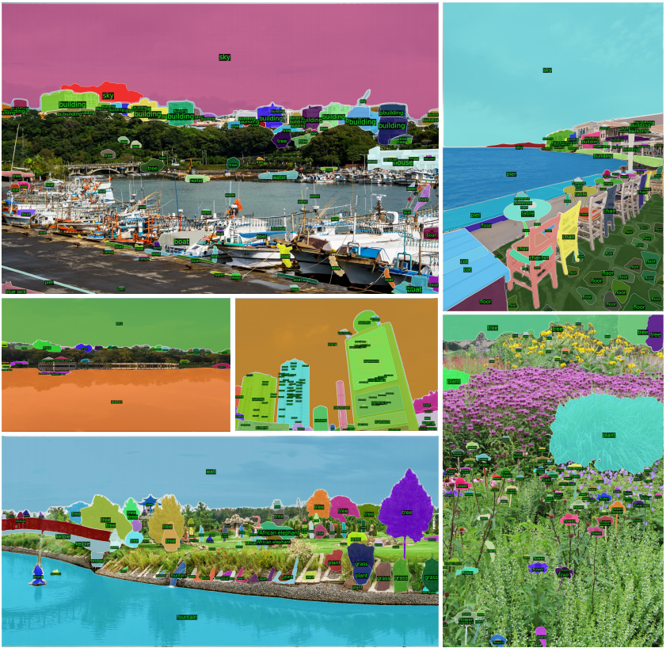

<p align="center">
  
</p>

<h1 align="center">Semantic Segment Anything (SSA)</h1>

### [Tech report]() (TODO)
> **Semantic Segment Anything**  
> Jiaqi Chen, Zeyu Yang, Li Zhang  
> Zhang Vision Group, Fudan Univerisity

Our _**S**emantic **S**egment **A**nything (SSA)_ project enhances the [Segment Anything dataset(SA-1B)](https://segment-anything.com/) with dense category annotations.
The SSA engine is completely automated, requiring no human annotators. It has the ability to annotate using an open vocabulary and can classify the basic categories of the COCO and ADE20k datasets. 
This tool fills the gap in SA-1B's limited fine-grained semantic labeling, while also significantly reducing the need for manual annotation and associated costs. It has the potential to serve as a foundation for training large-scale visual perception models and fine-grained CLIP models.
### 🤔 Why do we need SSA?
- Although SA-1B is a large image segmentation dataset with fine mask segmentation annotations, it lacks semantic annotations for training.
- While advanced close-set segmenters such as Mask2Former and Upernet, open-set segmenters like CLIPSeg, and image caption methods like BLIP2 can provide rich semantic annotations, they often lack the ability to capture edges effectively.
- By combining the strengths of SA-1B's fine mask segmentation annotations with the rich semantic annotations provided by these advanced models, we can train more powerful models capable of semantic segmenting anything.
### 🚄 Semantic segment anything engine
The SSA engine consists of two stages:
- **Step II: Close-set annotation.** We use a close-set semantic segmentation model trained on COCO and ADE20K datasets to segment the image and obtain rough category information. The predicted labels only include categories from COCO and ADE20K.

- **Step II: Open-vocabulary annotation.** We utilize an image captioning model to describe each cropped local region of the image corresponding to each mask, obtaining open-vocabulary categories.

- **Step III: Final decision.** We merge the close-set categories and open-vocabulary categories obtained in the previous two steps into a candidate category list. This list is then inputted, along with the cropped local image corresponding to each mask, into CLIPSeg. The model outputs the most likely category for each region.
### 📖 News
🔥 2023/04/09: The example of Semantic Segment Anything for SA-1B is released.  
🔥 2023/04/05: SA-1B is released.  

## Examples




## 💻 Requirements
- Python 3.7+
- mmcv-full 1.3.8
- mmdet 2.14.0
- transformers 4.6.1
## 🛠️ Get Started

```bash
pip intsall transformers
pip install spacy
python -m spacy download en_core_web_sm
git clone git@github.com:fudan-zvg/Semantic-Segment-Anything.git
cd Semantic-Segment-Anything
python models/classification/<method>.py
```

## 👍 Acknowledgement
- [Segment Anything](https://segment-anything.com/) provides the SA-1B dataset
- [HuggingFace](https://huggingface.co/) provides code and pre-trained models.
- [CLIPSeg](https://arxiv.org/abs/2112.10003), [OneFormer](https://arxiv.org/abs/2211.06220), [BLIP](https://arxiv.org/abs/2201.12086) and [CLIP](https://arxiv.org/abs/2103.00020) provide powerful semantic segmentation, classification, and image caption models

## 📜 Citation
If you find this work useful for your research, please cite our paper:
```bibtex
@misc{semantic2023,
    title = {Semantic Segment Anything},
    author = {Jiaqi Chen and Zeyu Yang and Li Zhang},
    howpublished = {\url{https://github.com/fudan-zvg/Semantic-Segment-Anything}},
    year = {2023}
}
```
